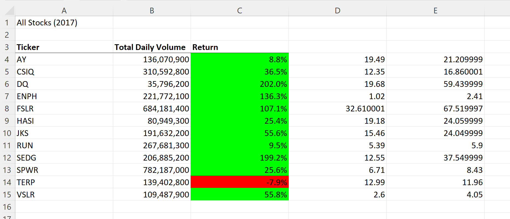
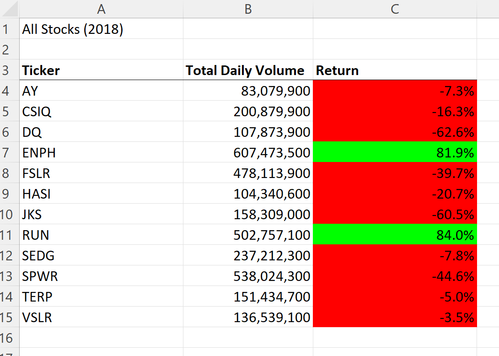

# Stock-Analysis

## Overview of Project

The purpose of this project was to refactor code to analyze stock data from any year within our workbook, and to refactor our code to increase the efficiency by looping through the data set. Originally, we used nested loop statements to analyze a small set of given data. Nested loops worked for our small data set.

The data sets were provided with the intent of facilitating the client's ability to perform analysis on a number of different stocks and their performance over a 2 year timeframe. A macro was created in VBA to output calculations about a number of stock options, allowing for intuitive analysis.

## Results

By using tickers to determine the type of stock that was being displayed, there are several conclusions based on the data given. One is that in general, the stock categories from 2017 tended to have a successful return (11/12 major stocks types yielded a positive return on the investment for the year of 2017). 

However, in 2018 only two of the twelve stock types had a positive return. From this, we can conclude that people probably made money off their stock in 2017, while in 2018 there was a much higher chance for their stock to have gone down in value.

### Original Code

### Refactored Code

## Summary

* Advtanges and disadvantages of refactoring code.

One huge upside to refactoring code is making the run time faster.This can be very important especially when working with extremely large datasets. In this case, we did not have an exceptional amount of code, but if we were working with millions of data points, making sure the program ran as fast as possible would be extremely important. The downsides of refactoring are very few, but one of the biggest worries is changing the data and losing interpretability.

* Advantage and Disadvantages of the original and refactored VBA script.

The refactored code was much more efficient in my case. When I first wrote code in my module, I was still trying to figure out the best way to display my findings. Upon my second pass through my workflow, I realized I had lots of unnecessary code which increased my run time. For me, there was no downside to attempted to refactor. My code ran smoother and was easier to read.
